# INTEGRANTE 4: Modelador UML / Diagramador

## Entregables Específicos
- **Diagrama de Clases UML** completo (integrando todos los patrones).
- **Diagrama de Componentes UML** actualizado.
- **Documento de especificaciones** del diagrama (propósito, notas de diseño, convenciones).

---

## Trabajo Independiente - Instrucciones

### Base para tu trabajo
Usarás los fragmentos y clases aportadas por los demás integrantes (Facade, Proxy, Observer, Strategy, Factory Method) para construir los diagramas completos. Mientras ellos implementan código, prepara la estructura base del Diagrama de Clases y del Diagrama de Componentes.

---

## Estructura Base: Diagrama de Clases (PlantUML)
> PlantUML recomendado: pega este bloque en un archivo `.puml` o en cualquier editor PlantUML para visualizar.

```plantuml
@startuml PoliMarket_DiagramaClases

' Paquete Bodega
package "PoliMarket.Bodega" {
  class SistemaInventario {
    +VerificarDisponibilidad(productoId: string, cantidad: int): bool
    +ActualizarStock(productoId: string, cantidad: int): void
  }

  class SistemaProveedores {
    +SolicitarProducto(productoId: string, cantidad: int): void
  }

  class SistemaAlertas {
    +EnviarAlertaBajoStock(productoId: string): void
  }

  class FachadaBodega {
    +VerificarYActualizarStock(productoId: string, cantidad: int): bool
    +SolicitarReposicion(productoId: string, cantidad: int): void
  }

  FachadaBodega --> SistemaInventario : usa
  FachadaBodega --> SistemaProveedores : usa
  FachadaBodega --> SistemaAlertas : usa
}

' Paquete Ventas
package "PoliMarket.Ventas" {
  interface ISistemaVentas {
    +RealizarVenta(vendedorId: string, productoId: string, cantidad: int): void
    +ObtenerClientes(): List<string>
  }

  class SistemaVentasReal {
    +RealizarVenta(vendedorId: string, productoId: string, cantidad: int): void
    +ObtenerClientes(): List<string>
  }

  class ProxySistemaVentas {
    -sistemaReal: ISistemaVentas
    -sistemaRRHH: SistemaRRHH
    +RealizarVenta(vendedorId: string, productoId: string, cantidad: int): void
    +ObtenerClientes(): List<string>
  }

  interface ISujetoVentas {
    +Registrar(obs: IObserver): void
    +Remover(obs: IObserver): void
    +Notificar(productoId: string, cantidad: int): void
  }

  class SistemaVentasNotificador {
    -_observadores: List<IObserver>
    +Registrar(obs: IObserver): void
    +Remover(obs: IObserver): void
    +Notificar(productoId: string, cantidad: int): void
  }

  ISistemaVentas <|.. SistemaVentasReal
  ProxySistemaVentas ..|> ISistemaVentas
  SistemaVentasNotificador ..> IObserver : notifica
  SistemaVentasReal ..|> ISujetoVentas : (opcional) puede disparar eventos
}

' Paquete RRHH
package "PoliMarket.RRHH" {
  class SistemaRRHH {
    +EstaAutorizado(vendedorId: string): bool
  }
  ProxySistemaVentas --> SistemaRRHH : valida con
}

' Paquete Entregas (Strategy)
package "PoliMarket.Entregas" {
  interface IMetodoEntrega {
    +CalcularCosto(peso: decimal, destino: string): decimal
    +CalcularTiempoEstimado(destino: string): int
    +RealizarEntrega(productoId: string, direccion: string): void
  }

  class EntregaExpress
  class EntregaEstandar
  class EntregaEconomica

  EntregaExpress ..|> IMetodoEntrega
  EntregaEstandar ..|> IMetodoEntrega
  EntregaEconomica ..|> IMetodoEntrega

  class ServicioEntregas {
    -metodoEntrega: IMetodoEntrega
    +SetMetodoEntrega(m: IMetodoEntrega): void
    +ProcesarEntrega(productoId: string, direccion: string, peso: decimal): void
  }

  ServicioEntregas --> IMetodoEntrega : utiliza
}

' Paquete Vendedores (Factory)
package "PoliMarket.Vendedores" {
  abstract class Vendedor {
    +Id: string
    +Nombre: string
    +Tipo: string
    +RealizarVenta(productoId: string, cantidad: int): void
    +CalcularComision(montoVenta: decimal): decimal
  }

  class VendedorJunior
  class VendedorSenior
  class VendedorTemporal

  VendedorJunior --|> Vendedor
  VendedorSenior --|> Vendedor
  VendedorTemporal --|> Vendedor

  abstract class VendedorFactory {
    +CrearVendedor(id:string, nombre:string): Vendedor
    -ValidarConRRHH(id:string): bool
  }

  class FactoryVendedorLocal
  class FactoryVendedorExterno

  FactoryVendedorLocal --|> VendedorFactory
  FactoryVendedorExterno --|> VendedorFactory

  class SistemaGestionVendedores {
    +RegistrarNuevoVendedor(id:string, nombre:string, tipo:string): Vendedor
  }

  SistemaGestionVendedores --> VendedorFactory : usa
}

@enduml
```


```text
OTRA OPCION SUGERIDA ELIJE LA QUE MAS SE TE ADAPTE
[ESQUEMA BASE - Diagrama de Componentes]
Componentes principales:
- Componente "GestiónVendedores" 
  (usa: Factory Method, depende de: RRHH)

- Componente "SistemaVentas" 
  (usa: Proxy, Observer; provee: ISistemaVentas)

- Componente "FachadaBodega"
  (usa: Facade; requiere: Inventario, Proveedores)

- Componente "GestorEntregas"
  (usa: Strategy; requiere: SistemaVentas, Bodega)

Interfaz de cada componente (puertos):
- ISistemaVentas
- IFachadaBodega
- IGestorEntregas
```

Herramientas Sugeridas:
draw.io (gratis, online)

Lucidchart (gratis con cuenta educativa)

PlantUML (textual, ideal para integración)  **(el codugo anterior es para este software)**

Instrucción específica: No esperes a que los otros terminen. Crea versiones preliminares usando los fragmentos proporcionados aquí. Cuando ellos entreguen su código, yo consodidare los ajustes.

Fecha de entrega al grupo: [Tu fecha] - Entregar ambos diagramas en PNG/PDF + documento explicativo.

